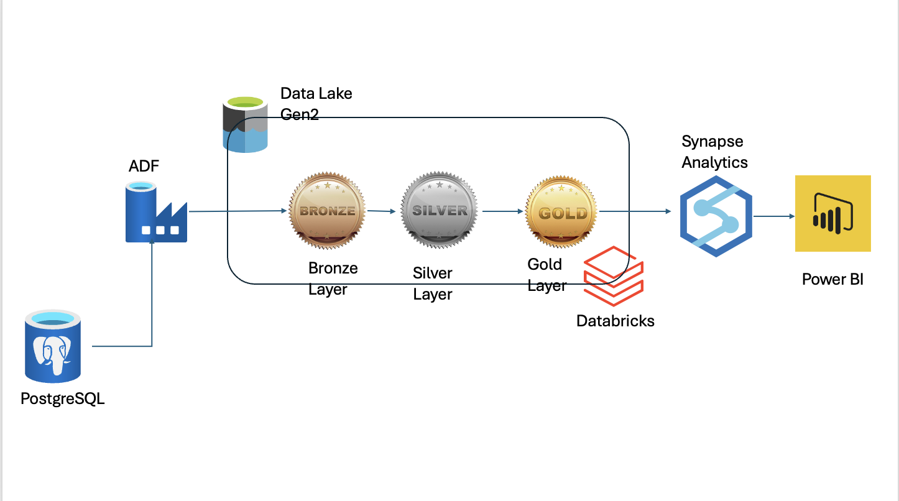

# Jaguar Land Rover Sales and Service Dashboard

## Project Overview

This project is designed to build a data engineering solution using the Azure platform to create a Power BI dashboard for monitoring Jaguar Land Rover's sales and service performance. The solution integrates various Azure services to process, analyze, and visualize data effectively.

## Architecture

The project architecture follows a structured layered approach:

1. **Data Source**: Data is ingested from a PostgreSQL database using Azure Data Factory (ADF).
2. **Data Lake Storage**: Ingested data is stored in Azure Data Lake Storage Gen2.
3. **Data Transformation**: Databricks is used to clean, transform, and enrich data across three layers:
    - **Bronze Layer**: Raw data storage
    - **Silver Layer**: Filtered and refined data
    - **Gold Layer**: Aggregated and business-ready data
4. **Data Analytics**: Processed data from the Gold layer is analyzed using Azure Synapse Analytics for reporting and advanced analytics.
5. **Data Visualization**: Power BI is utilized to create interactive dashboards displaying key business metrics.

## Key Features

- **Sales Monitoring**: Track sales performance by month and by employee.
- **Top Selling Models**: Visualize top-selling Jaguar and Land Rover models.
- **Employee Performance**: Analyze sales performance metrics for individual employees.
- **Interactive Dashboards**: Power BI dashboards offer interactive, real-time insights for stakeholders.

## Tools and Technologies

- **Azure Data Factory (ADF)**: For data ingestion and orchestration.
- **Azure Data Lake Storage Gen2**: For scalable and secure data storage.
- **Databricks**: For data processing and transformation.
- **Azure Synapse Analytics**: For data analysis and reporting.
- **Power BI**: For creating interactive dashboards and data visualization.
- **PostgreSQL**: The source database for raw sales and service data.

## Visuals

### Project Architecture

### Power BI Dashboard

## Usage

- Access the Power BI dashboard to gain insights into sales trends, employee performance, and top-selling models.
- Use Azure Synapse Analytics to conduct deeper data analysis and generate detailed reports.
- Transform raw data using Databricks to ensure clean and business-ready datasets.

## Conclusion

This project provides a scalable and efficient data engineering solution for Jaguar Land Rover, enabling data-driven decision-making through comprehensive insights into sales and service performance.

